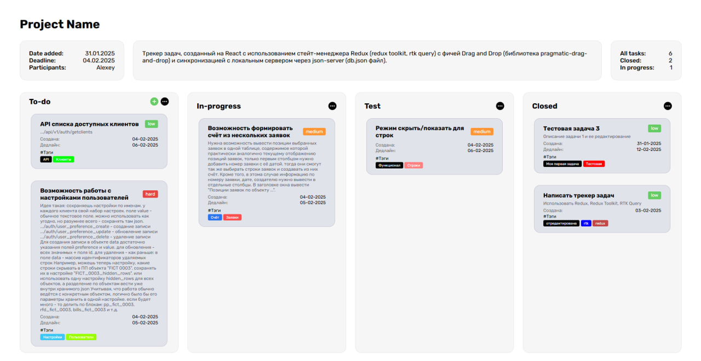
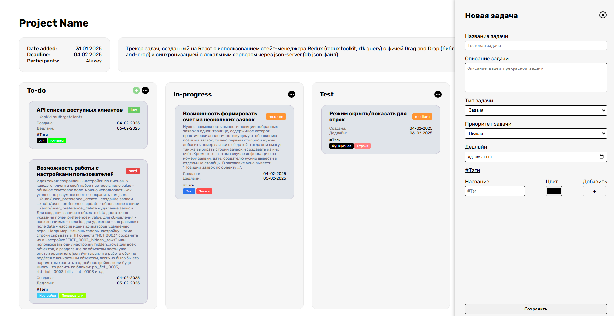
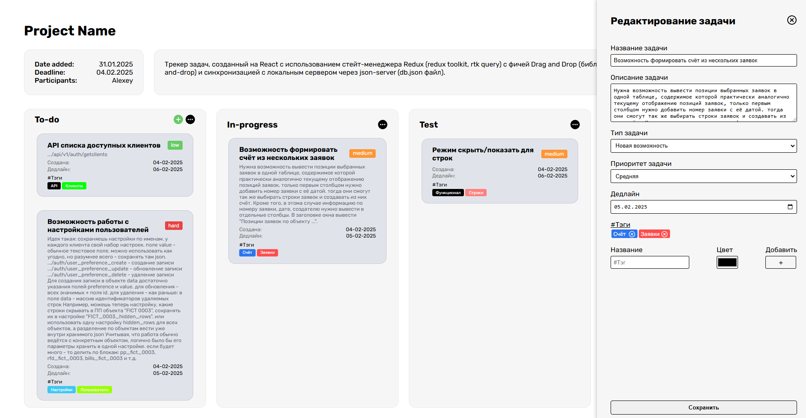

# Трекер задач

## О проекте

Трекер задач, созданный на React с использованием стейт-менеджера Redux (redux toolkit, rtk query) с фичей Drag and Drop (библиотека pragmatic-drag-and-drop) и синхронизацией с локальным сервером через json-server (db.json файл).

## Зачем

Опробовать возможности библиотек управления состоянием приложения redux, redux toollit, rtk query. _Дополнительно:_

- Все компоненты и хранилища покрыты тестами с помощью `Jest + React Testing Library`
- Опробована библиотека `pragmatic-drag-and-drop` для создания зон `drag and drop` и `draggable` элементов для осуществления обновления статуса задач.

## Демо







## Используемые технологии и библиотеки

- Создание пользовательского интерфейса: `React`
- Состояние: Redux, `Redux Toolkit`
- Работа с API: `RTK Query`
- Типизация: `TypeScript`
- Стилизация: `SCSS`
- Тестирование: `Jest`, `React testing library`
- Линтинг и форматирование: `Eslint`, `Stylelint`, `Prettier`
- Сборка: `Vite`
- Стандартизация коммитов: `Commitlint`, `Commitizen`
- Локальный сервер: `json-server`
- Drag and drop: `pragmatic-drag-and-drop`

## Структура проекта

```
.
└── /src
    ├── /assets
    |    ├──/images
    |    └──/styles
    ├── /components
    |    ├── /layout
    |    └── /ui
    ├── /hooks
    ├── /services
    ├── /store
    ├── /types
    ├── /utils
    ├── App.tsx
    ├── index.scss
    ├── main.tsx
    └── vite-end.d.ts
```

## Запустить локально

Установка зависимостей

```
npm install
```

Запуск приложения и локального сервера с данными

```
npm run dev
```

Запуск тестов

```
npm run test
```
